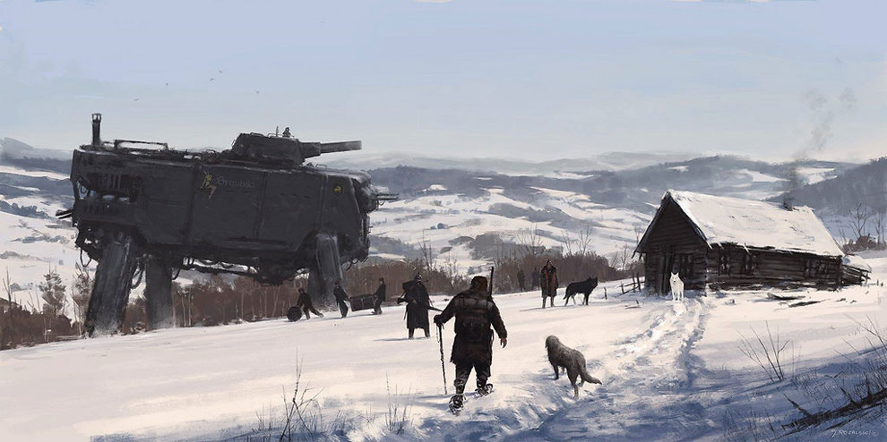

Creativity doesn't come from deep study of one particular field. It comes from combining ideas from multiple fields.

In fact, there's no such thing as a truly original idea. **Innovative ideas are just existing concepts, rearranged in novel ways.**

To expand this idea, let's look at the career of John Boyd.

John Boyd was a fighter pilot who went on to become one of the most original thinkers of the 20th century. His advocates call him the best military strategist since Sun Tzu.

His life's work was a theory of strategy called *maneuver warfare.* But he also applied the principles of that strategy to learning, to philosophy, and innovation.

But let's start at the beginning. John Boyd was a fighter pilot.

A really, really good fighter pilot. His nickname was 40 Second Boyd, meaning he could win any dogfight in under 40 seconds.

John Boyd was quite proud of this ability. But then he got curious: why did his maneuvers work so well?

He was just an ordinary guy (in his mind). What was special about him? What was special about what he was doing?

Flying fighter jets was, in the 1950s, an intuitive skill. Pilots explained popular moves through hand gestures. Knowledge was passed down directly from experienced practitioners.

There was no *theory* on how to win dogfights.

John Boyd created that theory. He spent years investigating, extensively studying physics.

While learning about thermodynamics, he had his light-bulb moment: dogfighting could be described by *energy states.*

I won't dive into the nitty-gritty of how his theory works (most of it goes over my head). But in short, he created a scientific description of effective dogfighting, based on the potential vs kinetic energy of the fighter jets.

But he didn't stop there. He wanted to see if he could apply the same principles to strategy.

Boyd spent years devouring books from diverse domains, from philosophy to theology to  history.

He synthesized this into a short briefing, [Patterns of Conflict](https://geekboss.com/boyd-patterns-of-conflict/). This slide deck contains an extensive description of how to fight (and win) modern wars.

His strategies were used to devastating effect by the US military during the First Gulf War. But again, Boyd didn't stop there.

Again, he wanted to understand his own innovation. He wanted to know why he came up with these theories, and not someone else.

Boyd was a talker, not a writer. But one of the few things he wrote down was a short paper called [Destruction and Creation](http://www.goalsys.com/books/documents/DESTRUCTION_AND_CREATION.pdf).

It's about innovation. But more specifically, it's about how we create mental models of the world: how we understand reality.

Though the paper is short, it's incredibly dense. I'll focus on one aspect here, which is *synthesis.*

### The art of rearranging

The first step to creation is, in fact, destruction. Or, to use a more specific term, *deconstruction*.

We take an area of knowledge, a collection of concepts, and split it into small parts.

We thus go from the *general* to the *specific*.

By splitting concepts apart, we create a "soup" of stuff, of as-yet unrelated concepts.

Once we have our soup, we can then reassemble them into a new general concept.

In Boyd's case, for his theory of dogfighting, he started with two domains: fighter jets and thermodynamics. From each domain, he took two main concepts: certain maneuvers and kinetic/potential energy. Combining them into something new, he created a revolutionary theory.

Here's John Boyd's favorite example of creation and destruction. We start with groups of concepts, from the domains of **water skiing, a tank, and a bicycle.** 

These topics seems random and unrelated. But we then split them apart into their individual elements...

...and out of these diverse elements, we make something new: **a snowmobile**.

**The parts are not revolutionary, but the combination is.**

John Boyd didn't learn anything new about fighter jets or thermodynamics, but by marrying the two, he brought clarity.

**This process of destruction and creation thus allows us to understand reality better.**

Revolutionary art does this implicitly. Picasso married Cubism (which was itself a rearranging of diverse concepts) to portrait painting, and created a new way of looking at reality.

A less "refined" example is the work of Jakub Rozalski, who took a steampunk aesthetic and an 18th century one, and fused them:

This idea extends beyond art. **Good entrepreneurship is about finding better concepts of reality.**

Lots of "disruptive" startups take software concepts and apply them to archaic industries. For example, Bitcoin is really just taking concepts from peer-to-peer networks and applying them to currency.

### Personal synthesis

You can also use this process on a personal level, for deciding what skills to acquire for your career.

[Tim Ferriss advises](https://www.youtube.com/watch?v=wCPbPMRNnvk) that **combining multiple valuable skills has a multiplicative effect.** A lawyer who understands cryptocurrency is much more rare, and thus valuable.

By combining two skills, you get a third skill: being able to find connections between the two domains, and make your own snowmobiles.

So how do we get better at synthesis? A good start would be to study disparate domains. **Be omnivorous in your information**, but in a casual sense: follow your diverse interests.

Then, try to make connections between ideas. The wider apart, the better. The more you practice, the better you'll get, and the more creative you'll become.

<ReadingListSignUp />