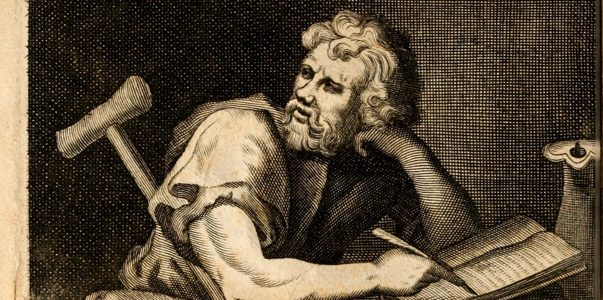

_Facial reconstruction of Zeno of Citium, who founded the Stoic school and who also thinks this article is bullshit._

The online debate on Stoicism typically is a back-and-forth between those who claim Stoics repress emotions to a harmful extent... and those who claim, no, that's not _real_ Stoicism.

In this case, the Stoic defenders seem dangerously close to a [no true Scotsman fallacy](https://en.wikipedia.org/wiki/No_true_Scotsman). "Yes, some Stoics engage in harmful behaviours and justify it via the philosophy, but they're just _doing it wrong_."

Which is fair. Being a true Stoic is difficult, something the philosophy acknowledges: Stoics are supposed to aspire to being a true "sage", with the acknowledgement they'll never actually get there.

However, even if many Stoics are "doing it wrong"... I'd count that as a serious downside of the philosophy. 

If to benefit from Stoicism you need to be a "true" Stoic, and only a few people are able to achieve that... the average person should look elsewhere.

In other words, I'm interested in average outcomes, not extremes.

Enter this study, [Stoicism and the good life](https://psyarxiv.com/6rtny/), which looked at the psychological outcomes of 600 practicing Stoics. They broke Stoicism into four qualities:

- Taciturnity (the belief that emotions should not be expressed)
- Serenity (the belief that strong emotions should not be felt)
- Endurance (the belief that physical suffering should be endured)
- Death acceptance (accepting mortality rather than fearing it)

(The above is not the authors' invention, but taken from the Pathak-Wieten Stoicism Ideology Scale.)

_Stoic philosopher-emperor Marcus Aurelius, who objects to a sample size of 600._

The authors measured Stoicism's effect on three different types of happiness:

- hedonia (pleasure; feeling good)
- eudaimonia (meaning; feeling like you're contributing)
- engagement in life (flow; feeling focused or absorbed in what you're doing)

Stoicism loves meaning but scorns pleasure, so the authors predicted Stoicism would be positively correlated with eudaimonic wellbeing and negatively correlated with hedonic wellbeing. 

In other words, we'd expect that Stoics would have meaningful lives, but ones that weren't particularly pleasurable. 

(Note that having a high knowledge of Stoic thought is not part of the scale, so we can view the study participants as potentially "naive Stoics," which probably describes most people who dabble in the philosophy.)

Here's what they found:

- Stoicism predicted lower hedonic wellbeing (how enjoyable you find life)
- it predicted lower eudaimonic wellbeing (how meaningful you find life)
- it predicted lower engagement with life
- it predicted more emphasis on the search for meaning in life

Splitting things up by trait:

- the more participants displayed Taciturnity and Serenity, the less they cared about meaning, and _the less eudaimonic wellbeing they showed._
- the more participants displayed Taciturnity and Endurance, the less hedonic wellbeing they showed.
- the more Taciturnity, the less engagement in life.

So... it's a surprising result. Stoics spend more time searching for meaning, but they don't seem to find it; they don't live more meaningful lives.

_Stoic thinker Epictetus, who had a very meaningful life, thank you very much._

Nor do they live more engaged lives. In theory, Stoicism is also supposed to promote a vibrant public life, being a Cicero, the "man in the arena." This doesn't seem to be the case with modern Stoics.

Is this a damning indictment of the philosophy? No, but it's a data point. For me, it casts doubt on the "Stoicism is for everyone, all the time" approach some authors champion. Either the philosophy requires significant investment to yield results, or it's only selectively useful.

[Here's the paper.](https://psyarxiv.com/6rtny/)