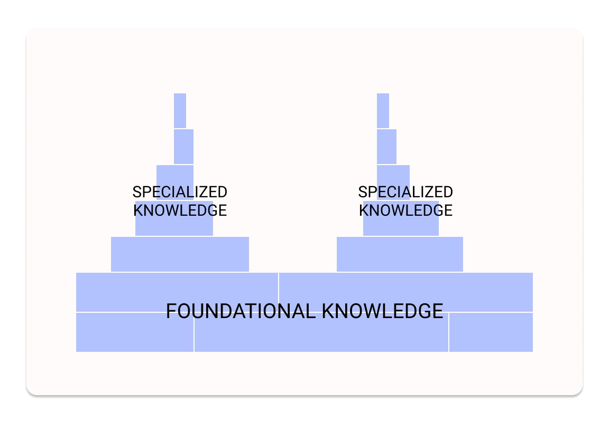
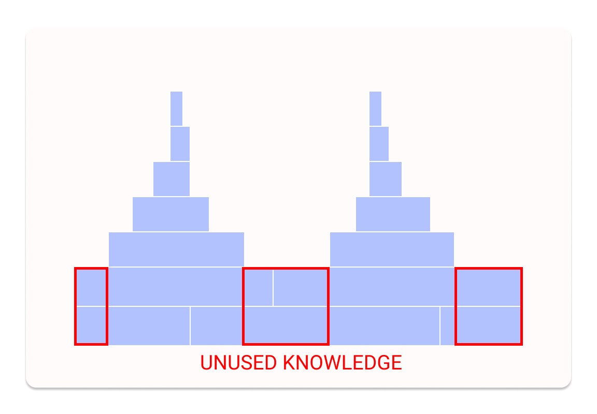
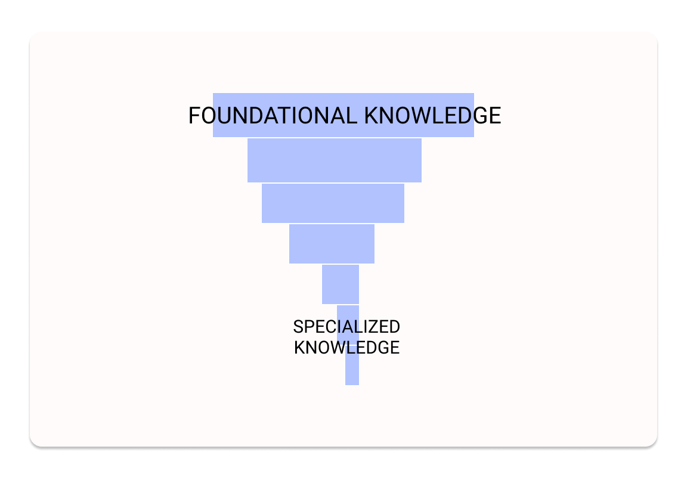
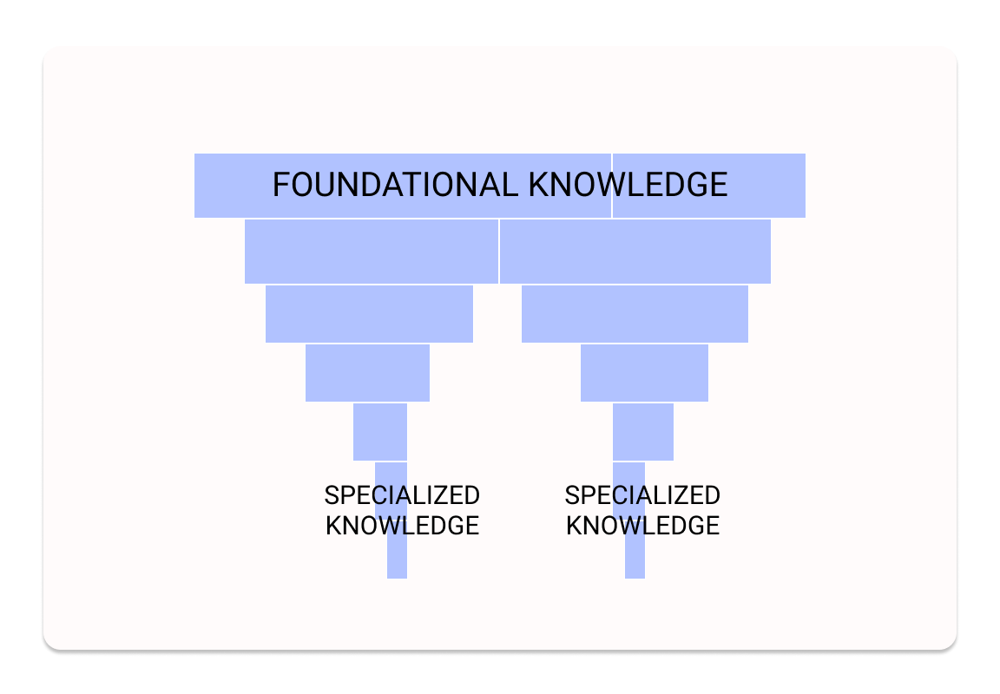
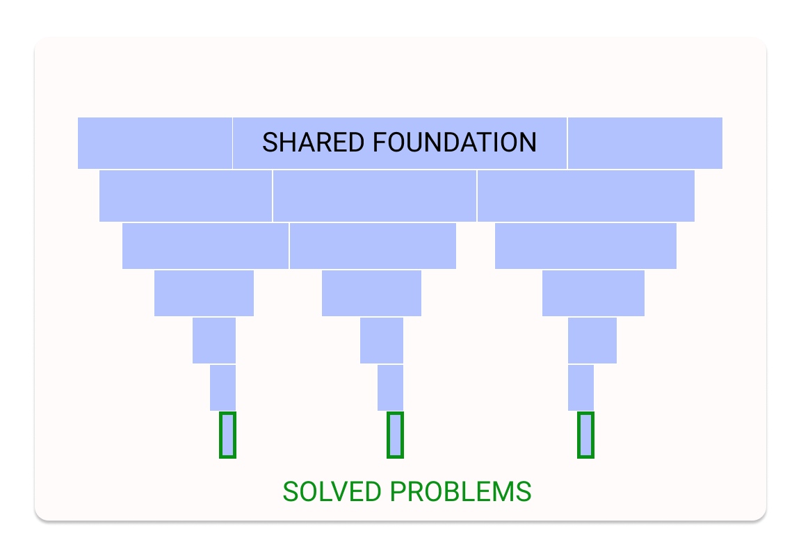
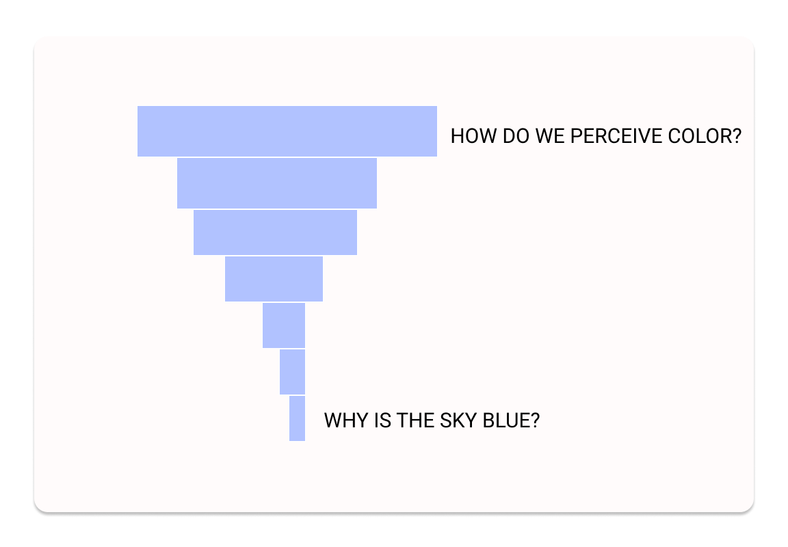

## The old model

With traditional education, you have a long wait before you start solving problems.

They give you a huge dump of data, over four to seven years, and then you go out into the world and start putting it to use.

It doesn't take a genius to see the waste here. Depending on the problem you work on, you'll only need a small subset of what you learned; and then, what are the chances you remember it well enough?

## What you need, when you need it

The most efficient model would be to give you exactly what you need to solve the current problem, exactly when you need it... when you're actually solving the problem.

But that would take too long. If you asked me to design a rocket and I first had to learn basic physics, your rocket would be significantly delayed.

## Building a foundation

The advantage of traditional education is to give you a foundational stack of knowledge, which allows you to understand, in theory, higher order concepts which you can then use. 

In software development, for example, most of the time I don't really need to know what's going. I slap together existing coding libraries and they work and I don't have to study how they work. But when my code breaks... that's when it helps to know what's going on.

And even if I forget everything i learned in school, it's far more efficient to be reminded than to learn from scratch.

So the traditional learning stack looks like a cluster of towers. You build a broad base of knowledge, and then you go off and specialize, which leads to spikes of specific problem solving abilities. Rather than having to start from scratch, you can build off your existing base, which saves time.

## Waste and efficiency

But there's still extraneous detail here. You've spent a lot of time studying knowledge you never needed.

What if we flipped things?

Let's start with a problem. Say, you want to create an app. To do that, you need to design and build it. Well, you don't really know how to design, so you have to go off and learn how to do it, which requires learning about color theory, and design software, and typopgraphy. And you don't know how to build it, so you need to learn a framework, which requires learning a language, which requires learning the basics of coding.

You need to go deep into what we might call "basic" knowledge, but you only need to go as far as required to solve the problem. So you get this kind of weird spiky upside down tower.

This is time consuming the first time you do it. But let's say you build another app, that's very different in approach. Now you have a new tower, but there's some overlap.

As you solve more problems in this space, you use more and more of the overlap. You get faster and more efficient. And there is zero waste. Everything you learn, you use immediately. 
More importantly, you always understanding the MEANING of what you're learning. You understand why it's important, and what you can use it for. 

## Beginner's mind

Incidentally, this is how a child learns. They start with a question: why is the sky blue? And you answer, because it reflects the ocean. And they go deeper: why is the ocean blue? And then, if you let them go far enough, they dig right down into the basics, as much as their tiny mind can hold. They build upside down towers.

Unfortunately, this kind of learning is really hard to do. You can't really do it in rocketry, because no one is going to let you build a rocket if you don't know basic physics. But it is increasingly possible in a lot of tech contexts.

You can learn to build an app by teaching yourself how to design and code. You could do that entirely independently, using this model. It would take a long time, but not as long as a degree, and I'd bet you'd be a lot stronger than most university students.

## Teachers and focus

Teachers are still very important in this model, but they're more advisers. You come with a question, they tell you where to look. they don't tell you what you should learn: you tell them what you want to learn. You're the driving force.

The other part of this is that it requires a rigorous focus on the problem. You have to start with a real-world problem and work backwards. Your work MUST have a purpose.

This is an advantage. it focuses your education and gives it meaning. For those who are afraid of an overly functional approach, there can still be time for tangents and appreciating the beauty of different approaches. But those must be wrapped in an overall package of solving a real problem. There must be a path.

## More to learn

This flipped stack of learning appeals to me a lot. I have more thinking to do about how to do it right, but I hope to explore building courses in this vein this year. 

I send out a weekly newsletter with the best of my writing and other interesting articles. You can subscribe below; if you want to chat about flipping the educational stack, just reply to the first email! I'd love to hear your take.

<EmailSignup />