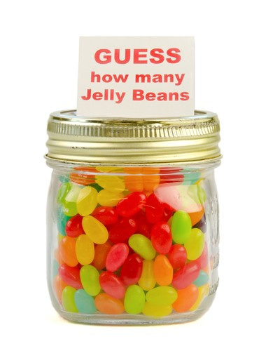

Machine learning is the process by which an algorithm gets less and less wrong.

This is really the essence of "learning," in most fields: be wrong less often.

The mechanism by which ML achieves this is called gradient descent. In this article, you'll learn what that is and why it matters.

But before we get there, let's talk about... jellybeans. More specifically, let's talk about how you learn.

## Human learning

You remember those contests at school fairs where you had to guess the number of jelly beans in a jar? I was pretty bad at it, as I imagine most people were.

But I think it's fair to say that if you practiced the art of jelly bean guessing, you'd get better at it.

If you trained with a bunch of different jars, over a period of months, you'd probably get more and more accurate with your guessing. Your parents might worry about you/wonder when you're going to move out of their basement, but you'd get better at jelly bean guessing.

How would you get better? Well, you'd learn that a small jar corresponds with a certain amount, a larger jar with a larger amount, and with enough practice.. you'd be able to look at the size of a jar and come up with a pretty good guess.

## Tracking progress

If you wanted to visualize your progress over time, you could graph it.
The best measure would be the difference between your guess and the actual number of jelly beans in the jar. This is a measure of how wrong you are.

Let's say these values represent the difference between your prediction and the actual amount:

Sometimes you guess too many, sometimes too few. 
We can graph it like so:

For simplicity's sake, we can treating positive and negative difference as the same thing; if you're under by 3 jelly beans, that's the same amount of "wrong" as being over by 3 jelly beans.

This is called taking the absolute of each error, which yields the following graph:

Your margin of error decreases over time, which shows you're learning!

## Descending

You can think of the line in that last graph as your "wrongness." As you get better, you slope towards zero. 

Remember that zero means no difference between your guess and the number of jelly beans, which means you are exactly correct.

As you descend, you get less and less wrong.

We can also call this minimizing error.

> MINIMIZING ERROR = DESCENDING THE SLOPE = BEING LESS WRONG

## How machines learn
Turns out, in machine learning, we follow the same process.

Let's say you're trying to figure out the algorithm for jelly beans. For a given jar volume (in milliliters squared), you want to be able to figure out the number of jellybeans (assume they are a fixed size).

(Necessary caveat: my jelly bean calculations for the rest of this article are approximations only, and should not be used to try to win any contests.)

We're trying to figure out the relationship between two variables: jar size, which we'll call x, and jelly bean count, which we'll call y.

For a given jar size (x), we want to be able to guess the jelly bean count (y).

We can state this another way. We want to minimize the wrongness of our prediction. 

For each guess, we want to have the lowest possible error. We'll call that e, for simplicity.

So for a given x value, we want to try to find the y that gives us the lowest possible e.

EQUATIONS

## Guessing and learning

To teach our machine to guess jelly beans, we give it a training set: a bunch of correct data about jar sizes and jelly beans counts.

TRAINING SET

The actual relationship between these values is that number of jelly beans = twice the jar size plus forty. But our machine doesn't know that yet; that's what it's trying to figure out.

(Once again I am not a jelly bean expert and I did not attempt to test this relationship with actual jelly beans.)

So we start training. We start our machine off with a random guess. Let's say we guess that the number of jelly beans equals three times the jar size plus forty.
Our ML algorithm runs through the training set, applying this calculation and comparing it to the right answer. Each time, it's off by a certain amount. We add all those errors together and average them.
This number could be negative or positive, but in machine learning we generally square it. This is called the mean squared error, or MSE.
MSE is just a measure of how wrong we are. For this training set, here's how far off we were for each value:
ERRORS
And thus here's the mean standard error:
MSE
Which we can plot on a graph. Remember our goal is to get as close to zero as possible!
GRAPH
Improving
So, our guess of the correct algorithm was wrong. Let's take a different guess.
Instead of guessing that jelly bean count = 3 * jar size plus forty, let's guess it will be 3.1 * the jar size plus forty one.
We calculate the MSE, and plot it...
GRAPH
Oops! We're going in the wrong direction! We're ascending the hill, instead of descending. So let's go the opposite direction. Let's make our equation 2.9x + 39.
GRAPH
Now we're descending. Over time, as we incrementally adjust those constants, we get closer to zero:
GRAPH
In time, we'll end up with the correct algorithm: 2x + 23. Our machine has learned how to guess jelly beans!
Where do we go from here?
The above process is called gradient descent. The term "gradient" refers to seeing how our position changes when we change one of our inputs.
I've simplified the process a lot, but this should give you an idea of what it is and why it's powerful. It gets even better when we're dealing with multiple variables. You can actually plot it in 3D space...
GRAPH
There are two big challenges with gradient descent, which I haven't touched on. The first is: how fast do we descend? If we go too fast, we'll overshoot the bottom; we'll take too big of a "step" and come up the other side of the valley.
The second is: what happens if we're in a false valley? Consider the below graph:
GRAPH
These are both interesting challenges that I'll have to cover in future articles. If you're interested, I send out a weekly newsletter covering the writing I do each week, plus interesting sources I find. Try it out:
