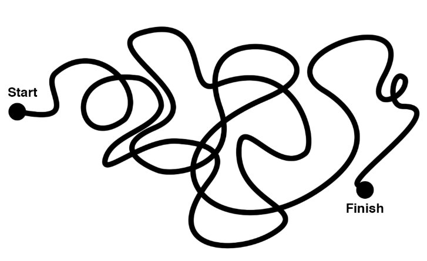
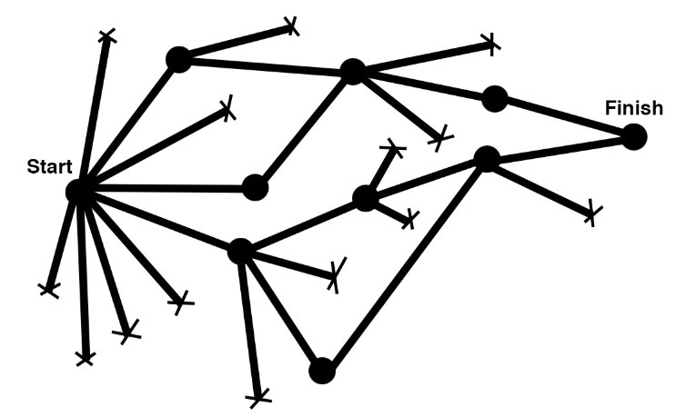

These are my notes on the book Little Bets by Peter Sims. 

The basic idea of the book is that you make progress on creative projects by trying a bunch of things, hitting dead ends, and continuing forward with what works.

These diagrams by [@joulee](https://twitter.com/joulee) does a great job of summing up the difference between the way we THINK creative people work, and the way it actually happens: 

Structured processes don't work. Instead, try things, fail, keep going.

Here's my top five takeaways from the book:

## 1. Creativity = exploration + synthesis

> “Creativity is just connecting things,” Jobs told Wired magazine. “When you ask creative people how they did something, they feel a little guilty because they didn’t really do it, they just saw something. It seemed obvious to them after a while. That’s because they were able to connect experiences they’ve had and synthesize new things."

There are no new ideas. Novel concepts come from rearranging or combining existing concepts.

This idea can be a hard one to swallow, because it feels inauthentic. We think true originality is having a "lightbulb" moment and coming up with something no one has ever thought of. That fanciful moment plays out in pop culture and history: think Newton and the apple, or Archimedes and "Eurekea!"

But true originality is just putting stuff together in unique ways. And in order to do so, you need exposure to lots of concepts. As the rest of the above Jobs quote says "the reason they were able to do that was that they’ve had more experiences or they have thought more about their experiences than other people."

[The more snowmobiles you can build, the more creative you'll be.](/creative-synthesis)

## 2. In high ambiguity situations, master plans are useless

Dwight Eisenhower claimed "plans are worthless, but planning is everything." Planning is useful to get us to consider all possibilities, but the plans themselves are an intention only.

Or, to put it in a gentler way, expect plans to change! Here's a handful of quotes from the book:

> "As Sarasvathy wrote, entrepreneurial plans are “made and unmade and recast through action and interaction with others.”"

>"When much is known, procedural planning approaches work perfectly well. When much is unknown, they do not."

>"Instead of trying to develop elaborate plans to predict the success of their endeavors, they do things to discover what they should do."

I love the line "do things to discover what you should do." You should start, and figure it out from there.

*You can't make progress by planning. You have to take action.*

This, of course, leads us to another famous Steve Jobs quote...

>You can’t connect the dots looking forward; you can only connect them looking backward.

In other words: you don't know enough to plan for everything. So start, and then adjust as you go along.

## 3. Growth mindset is the key to persistence

Having a fixed mindset means you think you are limited by your natural abilities. Fixed mindset people say "I'm not a math person."

Growth mindset people, on the other hand, say "this is tough, but I can learn it."

I heard this concept years ago, and used to open with it when I taught programming classes. Anyone can learn to code! Anyone! Believe in yourself!
But Little Bets expanded this idea by pointing out that growth mindset people are more likely to persist in difficult situations. Why? Well, they don't see sucking at something as a threat to their self-worth:
> “The bottom line is that the fixed mindset makes it hard to maintain confidence because difficulty, effort, and other people who are perceived to be better all pose threats. But, in a growth mind-set, the same things are opportunities.”

I've struggled with writing fiction because it's important to me to be good at it, and if I try to write and it sucks, I view that as a threat to my identity. It hurts. That's a fixed mindset, right there.

To be better, I should focus on the fact that trying and failing will lead to progress... eventually. Easier said than done, but that's the work.

## 4. "Yes, and..."

Giving and receiving feedback is tough. If you care about quality, and your teammate brings you something shitty, it's hard to balance your desire to collaborate with your perfectionism.

Little Bets tells how Pixar uses the concept of "plussing" to avoid it. It's basically framing critique as "Yes, and..."

Instead of "The buttons should be bigger in this design", you say, "I love the button colour, and we should make them bigger."

You frame your suggestion as enthusiasm for their work. You point out the good parts, and talk about how to make it even better.
Super simple, super easy, super powerful. 

## Conclusion

Check out Little Bets by Peter Sims--it's worth your time, and one of the best books I've read this year. On that note, don't forget to sign up for my reading recommendation newsletter. Once a month round-up of super short book reviews. I read good stuff, check it out!

<ReadingListSignUp />
