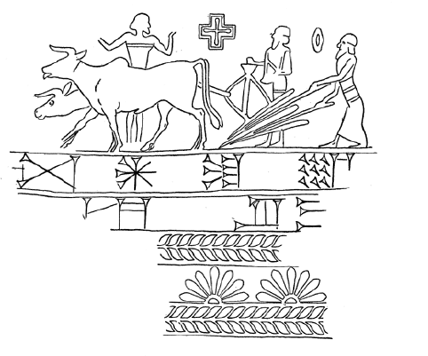
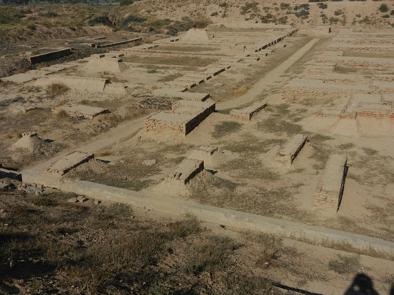

Cereal grains such as corn, wheat, and rice are not good for you. [Numerous](https://www.sciencedirect.com/science/article/pii/S1570677X14000665) [studies](https://www.ncbi.nlm.nih.gov/pmc/articles/PMC5946196/) [have](https://twitter.com/Mangan150/status/1148222856334958598) [shown](https://www.nzherald.co.nz/lifestyle/rotting-teeth-white-bread-rice-noodles-the-latest-culprits-to-tooth-decay/D6Z2W77AV36BBBBMVURXPQGWFY/) that these foods cause harm in large quantities.

And yet, many governments still recommend eating huge amounts of grains. **The standard is 6-12 servings of grain per day.** Twelve servings of grain! Insanity.

This trend is worldwide. **[42% of global calories](http://ricepedia.org/rice-as-food/the-global-staple-rice-consumers) come from rice, wheat, and maize.**

If grains aren't good for us, why do we eat so many of them?

### When did we start eating grains?

There are many factors at play here: inept or corrupt health officials, pressure from the farming industry, the influence of tradition. But to find the root cause of our troubled relationship with grains, we have to go way, way back, to the birth of civilizaton as we know it, and the first city states.

Large-scale agriculture began in the Near East, in an area covering Iraq and Syria known as the Fertile Crescent. In ancient Mesopotamia, the first complex city-states emerged. **Hunter gatherers or roaming herders were replaced by concentrated cities.**

**The crops of choice in the Fertile Crescent were wheat, barley, and spelt.** Farmers grew large quantities of these specific crops.

Nor was the Fertile Crescent unique in this aspect. Around the world, where complex city-states emerged, they relied on cereal grains.

In China, the first city-states grew millet and (later) rice. In South America, the Incans grew maize as their primary crop. In the Indus Valley, it was barley and wheat

**Early states were always grain-based. But why?**

It certainly wasn't for the nutrition. **[Early farmers showed much higher rates of malnutrition](http://www3.gettysburg.edu/~dperry/Class%20Readings%20Scanned%20Documents/Intro/Diamond.PDF) compared to their hunter gatherer peers.**

Nor were these crops particularly easy to grow. Early agriculture was back-breaking work, and [required more hours per week](http://www3.gettysburg.edu/~dperry/Class%20Readings%20Scanned%20Documents/Intro/Diamond.PDF) to gather food than what a hunter gatherer did.

But if grains weren't that nutritious and were difficult to grow, why did all early city-states rely on them? Why did they continue to be the main source of calories for literally thousands of years?

### The taxman loves wheat

A simple answer: **taxes.**

Cereal grains have several unique characteristics. They grow above the ground. Every plant in a given field ripens at the same time. Once harvested, they're easy to store and transport. They keep for a long time.

**If you're a tax collector in ancient Mesopotamia, these are ideal traits.** You could go around at harvest time, and be able to see how much each farmer has grown. You could easily take a portion of it, transport it back to the city's granaries, and store it.

Compare that to, say, potatoes. Potatoes take less effort to produce more calories, but they grow underground and can be kept there for a long time. A tax collector would need to dig up an entire field to get an accurate sense of how much a farmer has produced. Chickpeas, lentils, and yams all have similar properties that make them hard to measure.

The ancient Mesopotamians [had a saying](https://newrepublic.com/article/153991/make-irs-great-again): "You can have a king and you can have a lord, but the man to fear is the tax collector."

### Tax advantages

Why was taxability so important? The popular narrative is that large-scale agriculture enabled complex city-states to emerge. Let's complicate that a bit.

**Cereal grain agriculture allowed accurate taxation which allowed complex city-states.** Here's how that works.

In order to build a big temple, you need full-time workers. That means a percentage of your population is hauling stones instead of growing food. That means the rest of the population has to provide food for them.

To do this at a large-scale, you need a fair way to gather food from everyone, and then use it to feed the workers. That's taxation.

If you want a full-time army, same thing. You need to centralize and redistribute food.

**You can't have a complex city-state without this process, without taxation.** Cereal grains made that efficient.

### Grains vs. the world

In turn, building roads and walls and temples means more people want to live in or near your city, which means more taxable subjects. Having an army means you can conquer and enslave those around you, which means more labour to produce food.

Over time, these advantages start to snowball and... **grain-based states take over the world.** Now, today, we're left with the vestiges of the terrible diet.

### How to survive the agricultural revolution

So what can we do about it? Simple: **don't make cereal grains a major part of your food.**

Having a few grains is probably fine (even hunter gatherers would harvest wild grains when the opportunity came up) but make sure they are unprocessed.

The majority of your calories should come from vegetables, fruit, animal fats, meat, fish... you know, **the things we ate before we started living in big, grain-based states.**

We can't do anything about taxation, but we can do our best to survive its legacy.

<ReadingListSignUp />
