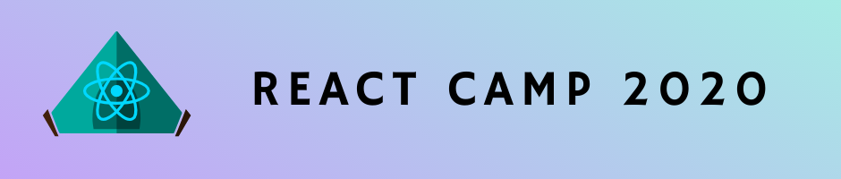

## It's time to build your first React project. I'll help you do it.

No more _thinking_ about learning React.

No more mindlessly following tutorials, without understanding what you're actually doing.

**Let's get building.**

### React Camp is a two week program that guides you through creating and deploying a real React application.

Features:

- a two week curriculum composed of 1-2 hour "challenges"
- a hands-on approach to learning that ensures you understand each concept
- a community of learners to support you

### What you'll learn

- how to deploy a React application so it's publicly accessible (we do this on day one!)
- how to use popular build tools to speed up your development
- all the most important React concepts like state, props, context, hooks
- how to optimize the structure of your React application
- advanced concepts like lifecycle methods and higher-order components  
- how to write easy-to-maintain React code that will impress employers

### Who should join React Camp

This course is for you if:

- you know some JavaScript, some HTML, some CSS, but are struggling to learn React
- you want to start building your portfolio to earn a job writing React
- you're tired of pain-by-numbers tutorials that don't push you to really understand what you're doing
- you learn best with others to support you and hold you accountable
- you know a little React but want to build your first real project

### Two weeks to start your React portfolio.

Want to get a job as a React developer? Having a portfolio of awesome projects is a great way to impress employers. We'll build your first one, together.

Every second day for two weeks, I'll send you a 1-2 hour challenge. Piece by piece, we'll build a fun and engaging app.

### Learn by doing.

But I won't send you a list of steps to complete. This isn't a standard follow-along-without-thinking tutorial.

Instead, I've gathered the best resources on React on the web. You'll use those to build your understanding of key concepts, and then be challenged to apply them.

You'll have to figure things out, because that's the best way to learn, and to prove you have what it takes.

### Don't learn alone.

Learning a new skill is hard. You may get stuck. You may get frustrated.

That's why you'll have access to a community of fellow learners, who are completing the exact same curriculum as you.

Struggling with a particular challenge? Reach out for help. Think you knocked it out of the park? Show off your work, and start mentoring others.

### Learn the skills you need to become a React developer.

Everything you need to know to build applications with React, in one course.

**Prequisites**: Beginner knowledge of HTML, CSS, and JavaScript.

React Camp launches on June 15th, 2020. Space is limited to 50 students. **Reserve your spot now and get a 50% discount.**

<Checkout />

### Who am I?

My name's Scott, and I currently work as a senior software engineer at Indeed.com. For years, I've been building products with React.

I've [written](https://scottdomes.com/tiny-components/) [quite](https://scottdomes.com/react-lifecycle-methods/) [a](https://scottdomes.com/react-native-authentication/) [few](https://scottdomes.com/react-native-sexy-forms/) [articles](https://medium.com/free-code-camp/everything-you-need-to-know-about-react-eaedf53238c4) [on](https://engineering.musefind.com/build-your-first-progressive-web-app-with-react-8e1449c575cd) [React](https://scottdomes.com/how-to-write-great-react/), and one book: _Progressive Web Apps with React_. I've also taught web development courses at [Lighthouse Labs](https://www.lighthouselabs.ca/).

Getting really good at React has enabled me to work for some amazing companies, doing what I love. I want the same for you.

Here's what past students & readers have said about me:

>"As my mentor he has really inspired me to push myself harder and improve even more. I feel like throughout my development career there have been a few pivotal people who really helped me take my skills to the next level, and Scott is one of them."

> "Great instructor and knows his product. I would recommend Scott to any company in the regard to understanding code and web development. Thanks again Scott."

> "His excellent written and verbal communication skills set him apart, as he can communicate and explain complex problems to non-technical people like myself with ease."

> "Best React guide on Medium, easy to follow for beginners."

> "I’m just uphill of beginner when it comes to React — I know the basics, and so articles like this are great refreshers for me to really strengthen my foundation. I even learned brand something new, namely the “ref” attribute. Great article, thank you!"

> "Scott you got inside the mind, rearranged the concepts and came out. Brilliant article. Thanks for sharing."

> "Absolutely fantastic article! I nodded my head the whole way through, and picked up a few new practice I intend to employ moving forward."

Build your first React project in just two weeks. Sign up today for only $25.

<Checkout />

### 30 Day Money-Back Guarantee

React Camp lasts two weeks, but I want to make sure you're 100% happy with it.

That's why I'm offering you 30 days to ask for your money back. If you finish the ENTIRE course and you're not happy with it, I'll refund your money.

Note that space is limited to 50 people, so I recommend reserving a spot today.

If you want to dip your feet into React and get a sense of my teaching style, try reading [Everything You Should Know About React](https://medium.com/free-code-camp/everything-you-need-to-know-about-react-eaedf53238c4).

Not ready? Sign up for my email list below and be notified when React Camp launches. 

<EmailSignup />
