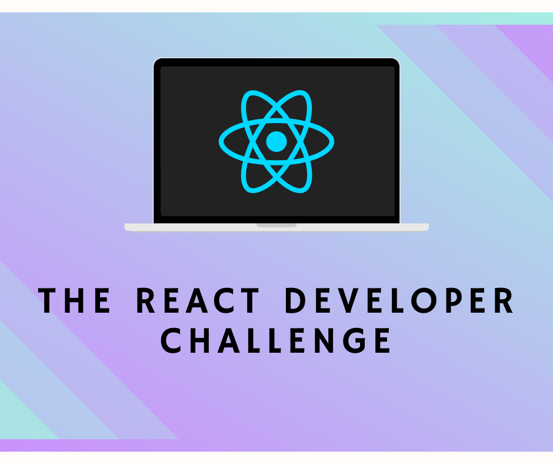

I've [written](https://scottdomes.com/tiny-components/) [quite](https://scottdomes.com/react-lifecycle-methods/) [a](https://scottdomes.com/react-native-authentication/) [few](https://scottdomes.com/react-native-sexy-forms/) [articles](https://medium.com/free-code-camp/everything-you-need-to-know-about-react-eaedf53238c4) [on](https://engineering.musefind.com/build-your-first-progressive-web-app-with-react-8e1449c575cd) [React](https://scottdomes.com/how-to-write-great-react/), including some in-depth tutorials.

But these tutorials have a few problems, if you're someone trying to learn React for the first time.

**Going through online tutorials for React won't get you that much closer to being a real React developer -- that is, getting a job.**

To do that, you need two things:

1. **The ability to actually _create_ using React;** i.e. build something from scratch, figuring out as you go
2. **Proof that you can do #1;** i.e., a portfolio that includes real projects

Online tutorials have a few other problems:

- **there's no one to help you if you get stuck...** other than leaving a comment and _hoping_ the author gets back to you
- **they're pretty shor**t, meaning you can't explore concepts in depth, or link those concepts to others (in other words, it's hard to get the "big picture" of how it all works)
- **there's no accountability**, nothing stopping you from quitting halfway
- **there's no continuity**. If you finish one tutorial, where do you go next?

Video courses mitigate some of the above, but too often fall into "follow-along" style teaching, where you just blindly copy whatever your instructor is doing.

**I wanted to do something different.**

## The React Developer Challenge

Here's the plan: **a two-week challenge, teaching you how to build with React.**

Together, we'll build a **real application**, step-by-step.

For two weeks, every two days **you'll receive a challenge**: a new piece to build.

The challenges will build on each other, helping you understand how concepts fit together, while you construct a real web app.

You will get resources and links to help you accomplish each goal, **but the actual implementation is up to you.** No copying and pasting code. You have to *really* learn it.

The best part: **access to a Slack channel with a community of learners**, _doing the exact same thing._

Get stuck? Reach out for help. Or if you're ahead of the curve, you can help others, solidying your learning through mentorship.

**I'll be active in that Slack channel, too, to answer questions and help unblock you.**

More details to come, but in short, here's what you get with the *React Developer Challenge*:
- **a two week program**, split into modules (1-2 hours of work), sent every second day
- **a complete guide to building & hosting your first React application**
- **improvisation-driven learning**; you figure stuff on your own, using your creativity and stretching your knowledge
- **access to community of fellow learners** for collaboration and support (including me!)

Sounds good? **Sign up now for half-price ($25)**. The challenge starts in June.

*This 50% discount is for early presale only. Regular price $50.*

Space is limited to 100 learners, to ensure a focused experience, **so grab your spot now.**

<Checkout />

Not ready yet? Sign up for my email list below to be notified when the challenge starts.

<EmailSignup />