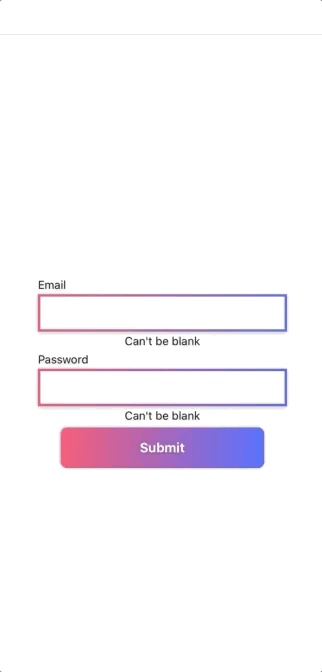

I'm trying to build and launch my first independent app, so naturally I spent many hours figuring out how to make the buttons look pretty.

Here's what I ended up with:

The animation looks a little janky in GIF form, but it's smooth on the device. The gradient shifts when the button is clicked. Eagle-eyed readers may notice that the same shift occurs on the gradients surrounding the fields.

How did I make this work? Let's dive in, since doing so will teach us a lot about React Native's `Animated` library, and the cool stuff you can do with it.

## Credit

Before we start, quick shout out to Rafael Mendiola for paving the way the article with his tutorial. 