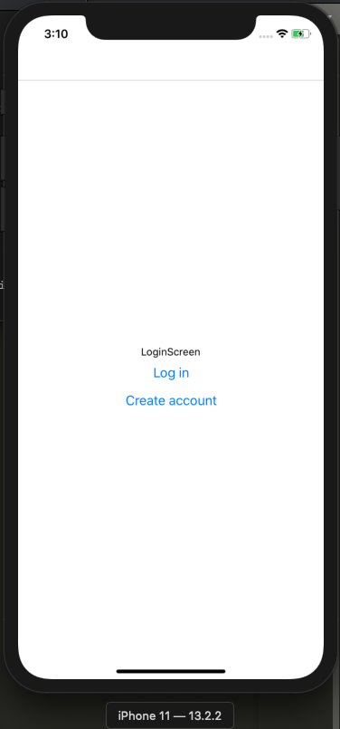

## What are we doing?

Every app you build will need a login/signup funnel. It's one of the most basic building blocks of a modern app. Let's learn how to do it the fast and easy way using React Native.

Our goal is to create a React Native app with the following features:
- A user can create an account
- A user can log into their account
- Once logged in, the user can access the app home screen
- The user can manually log out
- When automatically logged out due to their session expiring, the user is taken to the login screen

## Requirements

You need a general knowledge of how modern JavaScript development works. I won't be explaining the nitty gritty of things like `npm` or how React Native actually functions.

## Setting up our project

Follow [this guide](https://facebook.github.io/react-native/docs/getting-started.html) to install dependencies and create your project. This tutorial will be aimed at developing for iOS as the target OS, using the React Native CLI approach (rather than Expo). If you want to use Expo and/or Android, you can probably modify some of the content to make it work.

Our project name can be whatever you want, but I'll be using `AuthenticationBoilerplate`.

By the end of the linked guide, you should have your project created and running in the iOS simulator.

## Part 1: Navigation

Our app includes the following navigation flows:
- When the user logs in successfully, they are taken to the home screen.
- When the user clicks the 'Create account' on the login screen, they are taken to the create account screen.
- When the user clicks the 'Log in' link on the create account screen, they are taken to the login screen.
- When the user clicks the 'Log out' link on the home screen, they are taken to the login screen.

A whole bunch of functionality will need to happen between this navigation, but making sure we can navigate successfully seems like a good start.

To support moving between screens, we're going to use the `react-navigation` package.

### Setting up `react-navigation`

Installing the necessary dependencies should be straightforward:
```bash
yarn add react-navigation
yarn add react-native-reanimated react-native-gesture-handler react-native-screens react-navigation-stack
cd ios
pod install
cd ..
```

After running `pod install`, you should see something close to the following output:
```
Detected React Native module pods for RNGestureHandler, RNReanimated, and RNScreens
Analyzing dependencies
Downloading dependencies
Installing RNGestureHandler (1.5.2)
Installing RNReanimated (1.4.0)
Installing RNScreens (2.0.0-alpha.22)
Generating Pods project
Integrating client project
Pod installation complete! There are 31 dependencies from the Podfile and 29 total pods installed.
```

If that doesn't work, check their (official guide to getting started)[https://reactnavigation.org/docs/en/getting-started.html].

### Creating our screens

As established above, we need three screens:
1. HomeScreen
2. LoginScreen
3. CreateAccountScreen

In our project, create a new directory called `src/` and then a new directory inside that one called `screens/`. Inside `src/screens/`, create a file for each of our screens (e.g. `HomeScreen.js`).

For now, each file can look roughly like so:

```jsx
import React from 'react';
import { View, Text } from 'react-native';

const LoginScreen = () => {
  return (
    <View style={{ flex: 1, alignItems: 'center', justifyContent: 'center' }}>
      <Text>LoginScreen</Text>
    </View>
  );
}

export default LoginScreen;
```

### Creating our navigator between screens

`react-navigation` uses the concept of a "stack navigator" for basic navigation. In short, it's a stack of screens. Open up `App.js` in the root of your project and delete its contents.

Add the following to set up our navigation:
```js
import { createAppContainer } from 'react-navigation';
import { createStackNavigator } from 'react-navigation-stack';
import LoginScreen from './src/screens/LoginScreen';
import HomeScreen from './src/screens/HomeScreen';
import CreateAccountScreen from './src/screens/CreateAccountScreen';

const AppNavigator = createStackNavigator(
  {
    Home: HomeScreen,
    Login: LoginScreen,
    CreateAccount: CreateAccountScreen,
  },
  {
    initialRouteName: 'Login',
  },
);

export default createAppContainer(AppNavigator);
```

Reload your app (CMD + R from the simulator on Mac) and you should see the text 'LoginScreen'.

If you get the error `Direction is undefined`, try restarting the simulator, or double check you ran `pod install` when installing the packages as described above.

### Simple navigation

Alright, let's set up some simple navigation actions. To summarize, each screen allows the following actions:
1. From the LoginScreen, the user can go to the CreateAccountScreen or the HomeScreen.
2. From the CreateAccountScreen, the user can go back to the LoginScreen.
3. From the HomeScreen, the user can go back to the LoginScreen.

Each screen automatically receives a `navigation` prop by virtue of the stack navigator. Let's set up some buttons for easy navigation.

HomeScreen:
```jsx
import React from 'react';
import { View, Text, Button } from 'react-native';

const HomeScreen = ({ navigation }) => {
  return (
    <View style={{ flex: 1, alignItems: 'center', justifyContent: 'center' }}>
      <Text>HomeScreen</Text>
      <Button title="Log out" onPress={() => navigation.navigate('Login')} />
    </View>
  );
};

export default HomeScreen;
```

LoginScreen:
```jsx
import React from 'react';
import { View, Text, Button } from 'react-native';

const LoginScreen = ({ navigation }) => {
  return (
    <View style={{ flex: 1, alignItems: 'center', justifyContent: 'center' }}>
      <Text>LoginScreen</Text>
      <Button
        title="Log in"
        onPress={() => navigation.navigate('Home')}
      />
      <Button
        title="Create account"
        onPress={() => navigation.navigate('CreateAccount')}
      />
    </View>
  );
};

export default LoginScreen;
```

... and I'm sure you can figure out `CreateAccountScreen` from there.

With that done, you should be able to click around your app, moving from screen to screen. Success!



## Mock API

For real authentication, we'll call an API similar to the one we built in (my Rails authentication tutorial)[https://scottdomes.com/rails-authentication-deploy/]. But for now, for easy development, we're going to create a mock API.

A good mock API should do three things:
1. Include a delay for sending/receiving data.
2. Mimic the inputs and outputs of a request.

In our `src/` directory, create a new folder called `api/` and a new file called `mock.js` inside.

Two initial methods:
```js
const mockSuccess = (value) => {
  return new Promise((resolve) => {
    setTimeout(() => resolve(value), 2000);
  });
};

const mockFailure = (value) => {
  return new Promise((resolve, reject) => {
    setTimeout(() => reject(value), 2000);
  });
};
```

These methods mock the success or failure of an API call (based on a promise) after two seconds, and return the passed-in value.

This allows us to create our login method:
```js
export const login = (email, password, shouldSucceed = true) => {
  console.log(email, password);

  if (!shouldSucceed) {
    return mockFailure({ error: 'Something went wrong!' });
  }

  return mockSuccess({ auth_token: 'successful_fake_token' });
};
```

The `shouldSucceed` parameter allows us to dictate if we want to mock the success of failure of this request. This parameter is for development only, and will soon be removed.

If the request is successful, we return a JSON web token (for more, see (my Rails authentication tutorial)[https://scottdomes.com/rails-authentication-deploy/]).

If the request is not successful, we return a human-readable error.

Make the same method for `createAccount`: 
```js
export const createAccount = (email, password, shouldSucceed = true) => {
  console.log(email, password);

  if (!shouldSucceed) {
    return mockFailure({ error: 'Something went wrong!' });
  }

  return mockSuccess({ auth_token: 'successful_fake_token' });
};
```

And then a couple of methods for fetching the list of users:
```js
const getAuthenticationToken = () => 'successful_fake_token';

export const getUsers = (shouldSucceed = true) => {
  const token = getAuthenticationToken();

  if (!shouldSucceed) {
    return mockFailure({ error: 'Invalid Request' });
  }

  return mockSuccess({
    users: [
      {
        email: 'test@test.ca',
      },
      {
        email: 'test2@test.ca',
      },
    ],
  });
};
```

This method will send the appropriate token. We'll load the user list from the `HomeScreen`. The error ('Invalid Request') will let us know the user is not properly authenticated, and should return to the `LoginScreen`.

Now that our mock API is in place, let's start wiring requests to our screens.

### Login request

Inside our `LoginScreen`, make a new method to call the `login` method:

```jsx
import React from 'react';
import { View, Text, Button } from 'react-native';
import { login } from '../api/mock';

const LoginScreen = ({ navigation }) => {
  const loginUser = () => {
    login('test@test.ca', 'password')
      .then(() => {
        navigation.navigate('Home');
      })
      .catch((err) => console.log('error:', err));
  };

  return (
    <View style={{ flex: 1, alignItems: 'center', justifyContent: 'center' }}>
      <Text>LoginScreen</Text>
      <Button title="Log in" onPress={loginUser} />
      <Button
        title="Create account"
        onPress={() => navigation.navigate('CreateAccount')}
      />
    </View>
  );
};

export default LoginScreen;
```

If the request succeeds (which it should automatically), we should see our fake email + password logged in the console, and then after 2 seconds we will be redirected to the `HomeScreen`.

If you pass in `false` as the last parameter of `login`, you should NOT be redirected, and you should see the error in the console.


