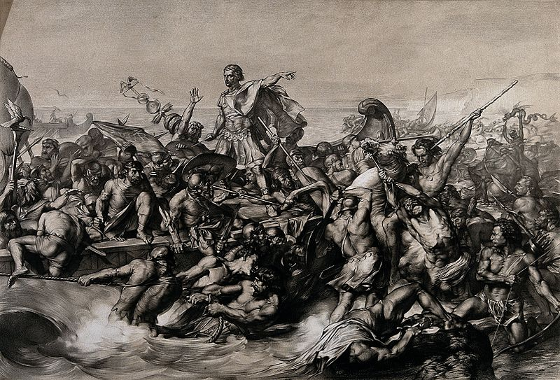
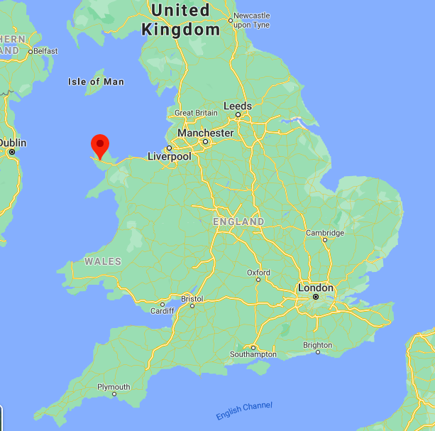

Anglesey is an island off the coast of Wales. Here's where it sits:

In 60CE, as part of their ongoing conquest of Britain, the Romans tried to conquer it.

Tacitus, the brilliant historian (whose father-in-law was potentially present for these events), paints an evocative picture of the beginning of the invasion of Anglesey:

"[The Roman general] built flat-bottomed vessels to cope with the shallows, and uncertain depths of the sea. Thus the infantry crossed, while the cavalry followed by fording, or, where the water was deep, swam by the side of their horses.

**On the shore stood the opposing army with its dense array of armed warriors**, while between the ranks dashed women, in black attire like the Furies, with hair dishevelled, waving brands.

**All around, the Druids, lifting up their hands to heaven, and pouring forth dreadful imprecations, scared our soldiers by the unfamiliar sight**, so that, as if their limbs were paralysed, they stood motionless, and exposed to wounds.

Then urged by their general's appeals and mutual encouragements not to quail before a troop of frenzied women, they bore the standards onwards, smote down all resistance, and wrapped the foe in the flames of his own brands.

**A force was next set over the conquered, and their groves, devoted to inhuman superstitions, were destroyed.** They deemed it indeed a duty to cover their altars with the blood of captives and to consult their deities through human entrails."

Though Tacitus paints it as a dominant victory, the Roman army likely didn't make it far before they were recalled to deal with Boudica's rebellion.

Either way, what a passage.

Cover photo is of Caesar invading Britain, found [here](https://commons.wikimedia.org/wiki/File:Caesar%27s_first_invasion_of_Britain;_Caesar%27s_boat_is_pulled_Wellcome_V0048276.jpg).