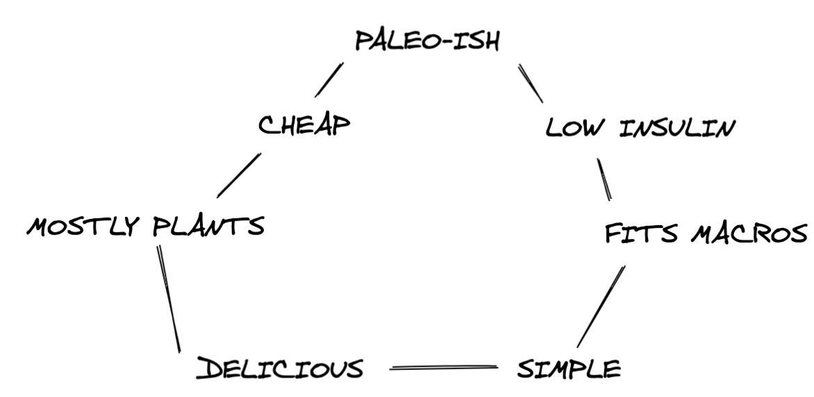

When I first moved out on my own in my early twenties, my food requirements were simple.

1. I didn't want to spend too much money on groceries
2. I wasn't a very good cook
3. I liked what I liked.

The best meals were those that were cheap, simple, and delicious.

Behold, the holy trinity of young Scott's food:

Evaluating whether a meal fits these criteria is pretty easy.

But also at that time, I was growing more and more interested in nutrition. I started to care about what I put in my body.

I had to introduce a fourth requirement: healthy.

Behold, the holy, uh, quaternity?

But "healthy" isn't like the other requirements. Healthy isn't easy to define.

It varies between different diets, different books, different models.

Here's how a few different diets define good food vs bad food:

**Keto**: whatever keeps you in ketosis, AKA low carb

**Slow carb**: whatever is on the "good food" list here (non-processed food, mostly)

**Whole 30**: anything that unprocessed

**Paleo**: food that our ancestors would have recognized

There's some obvious commonalities here. Natural, whole foods dominate the diets.

Michael Pollen has a lovely heuristic for what to eat: "Eat food. Not too much. Mostly plants."

>Eat food. Not too much. Mostly plants.

By looking at all these diets and doing a lot of reading and thinking, I've settled on the following definition of when a meal is healthy:

- fits my macros
- mostly plants
- minimally processed/maximally paleo
- low insulin response

Let's talk about these one by one.

### A healthy meal must fit my macros

I track the three macronutrients (fat, protein, carbs) using an app called Lose It (similar to MyFitnessPal). The app tells me what percent of my daily calories came from each macronutrient. 

I aim for 25% protein, 40% carbs, and 35% fat. So a good meal has to roughly match that, or balance out another meal in that day. I'm fine with plus or minus 5% in each category.

It's hard to eat a bunch of crap and still hit your macros. Plus, your body tends to crave what it's not getting enough of, so if you go heavy on the carbs, you'll have a big craving for peanut butter later (or whatever your fatty vice is).

(Side note: I'm intrigued by the idea that your body can be hungry for a particular category. Next time your stomach is growling, picture different foods and note how much you crave them. Usually you'll want things from a particular category e.g. high fat or high carb).

### A healthy meal is mostly plants

Straight from Mr. Pollen! "Eat your veggies" is the oldest and most persistent dietary recommendeation. 75% plants is ideal.

I exclude things that _came_ from plants (fruits, nuts), since those don't usually have the same benefits. Dark coloured veggies are still king.

### A healthy meal is minimally processed/maximally paleo

The Paleo diet theorizes that we haven't evolved much in the last ten thousand years, yet our diet is vastly different, which leads to modern health ailments.

Your cavemen ancestors would never eat processed sugar, yet it's in so many foods. They wouldn't eat processed grains, yet we do that all the time. They wouldn't even recognize our modern fruit! Most fruit has been bred to be as sugary and sweet as possible.

I'm not super strict about this rule; processed food happens to be delicious, and not __all__ processed food is bad for you.

But the less modern products, the better.

### A healthy meal triggers a low insulin response

This great article made a few things "click" in my head. What do all these popular diets have in common? Almost all of their recommended foods provoke a low insulin response from the body.

Why is that important? Well, processing insulin is hard. It makes you hungry, and it makes you fat. Go easy on your poor old body.

This rule means, in effect, avoid sugary things. But also skip potatoes.

## Putting it into practice

These four rules have significant overlap. A "mostly plants" meal would be low insulin and minimally processed. But I find it helpful to keep all four in mind.

This, of course, complicates my requirements for food. Behold... this thing:

I am by now means __good__ at following this diet. But I want to be better at it.

I intend to use this page to collect a list of delicious meal that satisfy all four criteria... AND are cheap AND are simple.

## Recipes

### Breakfast hash

Damn, this one is good. And satisfying. And healthy.

Things you need:
- a big sweet potato
- olive oil (or avocado oil, etc)
- good spices (paprika, cayenne pepper, chili pepper, cumin, salt, pepper)
- about four mushrooms
- half a zucchini
- half a red bell pepper
- goat cheese
- four eggs
- any other veggies you want to add; go nuts!

#### The steps:

1. Cut the sweet potato into one inch cubes, put it on a baking tray, drizzle with a tablespoon of olive oil, sprinkle with salt and paprika, bake at 425 F for 40min (or until soft & crispy)

2. When the potatoes are close to done, grab a pan or wok and stir fry the veggies. Add ALL the spices!

3. When the veggies are soft and well-cooked, push them aside and crack some eggs into the pan. Salt the eggs and then scramble them into the veggies.

4. Add a cup of sweet potato to the pan when it's done baking.

5. Add four tablespoons of goat cheese and mix around.

6. Once the eggs are cooked, plop it on a plate, and dig in.

Final product, which is not very picturesque but I promise very good:

PICTURE
