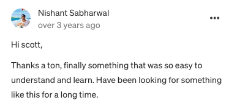
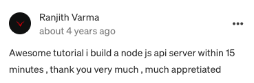
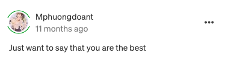
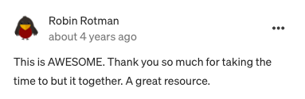
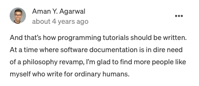
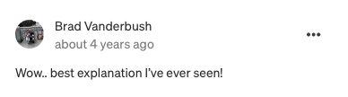
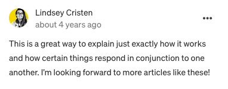
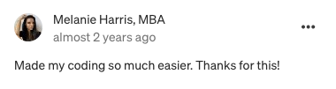
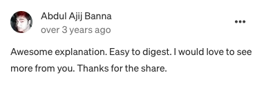
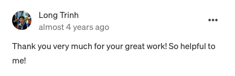

My name's Scott, and I've been writing software tutorials for years now. My articles have over 2 million views, and I've published a book along the way. 

However, there's something that's always bothered me: **most beginner programming courses are garbage.**

Three reasons why introductory programming courses frustrate me:

- They teach too much too fast, which makes students feel overwhelmed and frustrated
- They usually teach you only one programming language, when the really valuable skill is being able to read & understand multiple languages
- They teach you stuff without explaining why it's useful, or better yet, __showing you__ why it's useful

Now, I've seen courses that fix one or two of these problems. But never one that excels at all three. So I decided to build it.

Coding is fun. It's also incredibly valuable. It can help you launch an exciting new career, or make you better at your current job. In a world dominated by software, it's quickly becoming essential to be able to think in code.

It's also easier than most people think. It's easy to get overwhelmed by the amount of __stuff__ there is to learn. Why are there so many programming languages? Which one should I start with? What's the difference between them?

Here's the thing that nobody thinks to tell you: most programming languages are very similar. **They're all trying to solve the same kind of problem: how to get a computer to do what you want.**

For that reason, there are certain patterns that exist that are true for all coding languages. Learning those universal principles is the shortcut to becoming great at coding.

My course, Thinking in Code, focuses on teaching you those patterns. You'll learn four programming languages at once. I know, sounds hard, but it's much easier than you think. You'll learn to see how they're different, and how they're the same. You'll be able to take that knowledge and apply it to __any programming language you want to learn.__

My goal with this course is to make you feel you can solve any coding problem that comes your way. Because you can.

And because I want this course to be fun and engaging (and NOT overwhelming or frustrating), I've broken everything down into small, focused lessons. You'll be faced with real coding challenges. You'll have to write real code to solve them. But you'll get all the context and explanations you need.

More than that, I'll teach you the essential skill of coding: **using the internet to learn what you need to know**. I don't know why so many courses skip this part. It's a key part of building software. 

If you know the principles of coding, *and* you know how to find the resources you need to solve the problem in front of you, you'll be unstoppable. I mean that.

That's the goal of Thinking in Code. It only costs $9, and you can get a full refund if you're not happy with it. It will take you anywhere between a few hours and a few days to complete, but you'll have access to it for life.

Ready to start your coding journey? Want to see what you can build with code? Check it out below.

LINK

**Thinking in Code is the course I wish I had, when I started programming.**

In 13 short modules, you'll go from reading code in multiple programming languages to writing code in multiple languages. And it won't ever be overwhleming. 

By slowly introducing you to essential concepts, and letting you see them in action, you'll build your coding skills, step by step. 

By the end of this course, you'll feel confident working with code. If not, I'll give you a full refund. No questions asked, no time limit.

Start coding in ten minutes:

BUY

Want to learn more? Here's a quick example of the code we'll start off with:

```
print('Hello <NAME>! Congratulations! You executed your first code.')
```

And here's the code we'll end with:

```
const friends = [{ name: 'Scott' }, { name: 'Bob' }, { name: 'Alice' }];

function capitalizeName(user) {
  user[name] = user[name].toUpperCase();
};

friends.forEach(friend => capitalizeName(friend));
```

By the end of this course, each line of the above will make perfect sense. (In fact, you'll be able to spot a few ways to make it better!)

Here's the full list of modules:

1. Why thinking in code matters
2. How to reach fluency
3. How to learn what you don't know
4. Setting up for the course 
5. Variables & simple math
6. Functions
7. Control flow
8. Booleans & comparisons
9. Lists & loops 
10. Dictionaries
11. Writing readable code
12. Libraries
13. Learning to build 

Curious who I am? My name is Scott, and I've been working as a software developer for five years now. I've worked for big companies and small startups. I've taught introductory courses in the past, written dozens of programming articles, and published a book on building apps. 

Here's what people say about my teaching:

> 5 out of 5 across the board. The students describe Scott as patient and helpful and always made them feel as though their questions were important. They enjoyed his style of delivery and ability to cover a lot of information without making it feel overwhelming. 

> Scott is an awesome teacher, great at showing examples and clear with them as well.
One of the better teachers all together I have learned from... making this course a lot easier.













Ready to start your coding journey?

Click here
