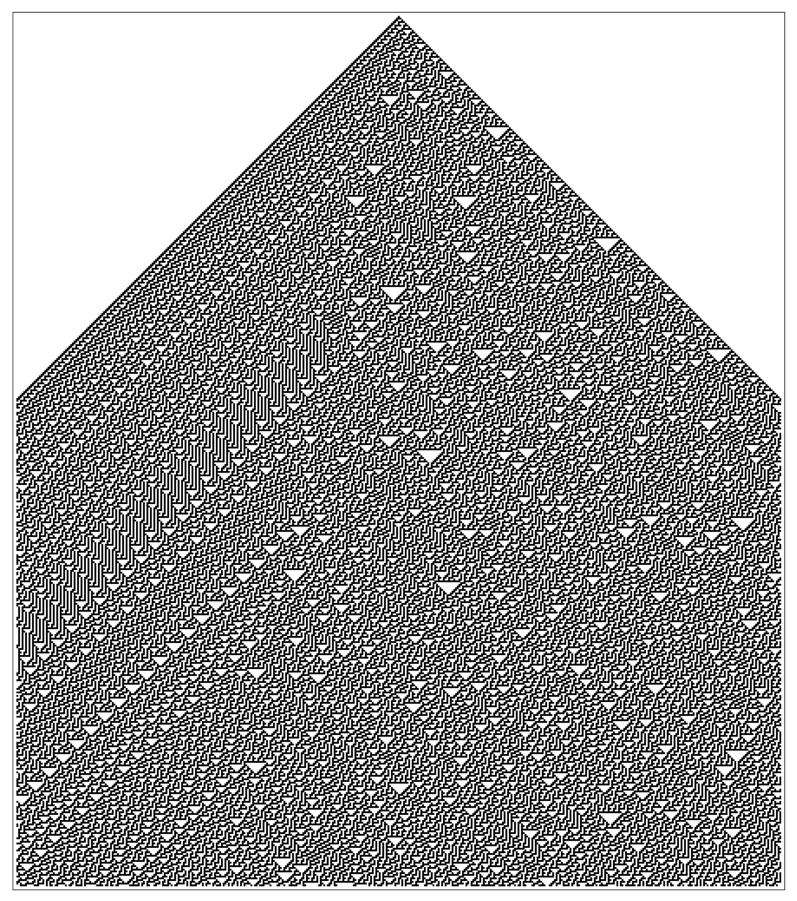

## The Theory of Everything

The ultimate goal of physics is finding the so-called Theory of Everything.

This theory would be a single framework that explains all physical aspects of the universe. Right now, we can explain many aspects pretty well. But there's one major divide.

We have the theory of general relativity, which works very well for big things. We also have the theory of quantum mechanics, which works well for very small things.

But we don't have a way to combine them.

The Theory of Everything would be a single set of equations that explain all interactions between matter, energy, space, and time. It would explain the origins of the universe, the orbit of the earth around the sun, and all the weird quantum behaviour we kept uncovering.

When you stop to think about it, this does seem a little crazy. Can a few equations really explain everything? The universe is mind-blogglingly massive and complex. Can we possibly reduce it all to a bit of math?

Computer scientist Stephen Wolfram says we can, and here's how.

## Wolfram's emergent complexity

Wolfram has had a very busy and storied career in both computer science and physics, but today we'll focus on just one contribution. Wolfram proved that you can generate complex behaviour from a few very simple rules.

Let's take a simple grid, like so. The grid is divided into cells, and in the middle of the very top row, one cell is filled in.

<WolframPattern hideButtons />

From there, you can proceed row by row down the grid (second row, third row, fourth row), filling in cells. Which cells you fill in depends on what rule you define.

Here's an example rule. If the same cell in the previous row is filled in, we fill it in again. Click Run below to see what pattern this generates.

<WolframPattern defaultRule={1} />

Not very exciting, is it? But we can add some more interesting rules. What if we say, if the cell to the left of the cell in the previous row (their left neighbor) is filled in, fill it in?

<WolframPattern defaultRule={2} />

Now we have an angled line. A little more interesting.

Let's start adding some complexity. In the below grid, the rule is this: we fill in the cell if it was filled in on the previous row, or if either neighbor on the previous row was filled:

<WolframPattern defaultRule={254} />

Thus we get a pyramid shape.

## A fractal pattern

Now: what if we fill in the cell if ONE neighbor is filled, but not both?

<WolframPattern defaultRule={90} />

This is a fractal shape, an endlessly repeating pattern. It's neat to look at. It's also very predictable. It will repeat the same pattern on and on if we had 1000 cells, or 10,000 cells.

## A random pattern

The next rule is much more interesting. This is where Wolfram started getting excited. Here, the rule is a little more complicated:

> IF either the left neighbor is filled, OR one of the right neighbor or the previous cell.

This is what's known as an "exclusive or". If the left neighbor is filled, but NOT the previous cell or its right neighbor, then we fill in the cell. If the left neighbor is filled AND either of the previous cell or its right neighbor, then we do not.

In other words, fill the cell if one of these is true, but not both: `left neighbor is filled` OR `right neighbor is filled or previous cell is filled`.

Watch the pattern:

<WolframPattern defaultRule={30} />

The left side of this result looks pretty predictable. But the rest is not. It follows no predictable pattern at all. In fact, if you execute the same pattern for 500 rows...

_[Source](https://www.wolframscience.com/nks/p29--how-do-simple-programs-behave/)_

Or even 1500...

_[Source](https://www.wolframscience.com/nks/p30--how-do-simple-programs-behave/)_

... you can see the right side looks very chaotic. It is, in fact, entirely unpredictable, or what we'd call random.

We managed to get a random output with a relatively simple rule. That's how easy it is to generate true complexity.

## Building your own patterns

All the patterns draw from the previous cell and its neighbors. We can represent them like so:

> left neighbor - previous cell - right neighbor

Let's make it simpler to show which are filled/unfilled, by using `1` to represent filled, and `0` to represent unfilled.

So if all three are filled, it would be `111`. If all three were unfilled, it would be `000`.

Just the left neighbor is filled? `100`. Just the middle? `010`.

There are eight possible combinations of those three cells. Here they are:

<table>
  <thead>
    <tr>
      <td>111</td>
      <td>110</td>
      <td>101</td>
      <td>100</td>
      <td>011</td>
      <td>010</td>
      <td>001</td>
      <td>000</td>
    </tr>
  </thead>
</table>

When we're defining a rule for our grid pattern, we can represent it using this table. For example, if the rule is "only fill the cell if all three cells above it are filled", we can show it in the following table:

<table>
  <thead>
    <tr>
      <td>111</td>
      <td>110</td>
      <td>101</td>
      <td>100</td>
      <td>011</td>
      <td>010</td>
      <td>001</td>
      <td>000</td>
    </tr>
  </thead>
  <tbody>
    <td>1</td>
    <td>0</td>
    <td>0</td>
    <td>0</td>
    <td>0</td>
    <td>0</td>
    <td>0</td>
    <td>0</td>
  </tbody>
</table>

The "1" under "111" stands for "fill the cell if all three cells above it are filled."

Our fractal shape appeared when our rule was "if one neighbor is filled, but not both." We can show this in binary like so:

<table>
  <thead>
    <tr>
      <td>111</td>
      <td>110</td>
      <td>101</td>
      <td>100</td>
      <td>011</td>
      <td>010</td>
      <td>001</td>
      <td>000</td>
    </tr>
  </thead>
  <tbody>
    <td>0</td>
    <td>0</td>
    <td>0</td>
    <td>1</td>
    <td>0</td>
    <td>0</td>
    <td>1</td>
    <td>0</td>
  </tbody>
</table>

This widget lets you build your own patterns from this binary notation:

<BinaryWolframPattern />

If you want to make a rule we haven't seen before, try the following:

<table>
  <thead>
    <tr>
      <td>111</td>
      <td>110</td>
      <td>101</td>
      <td>100</td>
      <td>011</td>
      <td>010</td>
      <td>001</td>
      <td>000</td>
    </tr>
  </thead>
  <tbody>
    <td>0</td>
    <td>1</td>
    <td>1</td>
    <td>0</td>
    <td>1</td>
    <td>1</td>
    <td>1</td>
    <td>0</td>
  </tbody>
</table>

The bottom row spelled out is '01101110'. This is a handy way of writing out our rules.

Try plugging in the following patterns:

Single line: `0 0 0 0 0 1 0 0`

Pyramid: `1 1 1 1 1 1 1 0`

Fractal: `0 0 0 1 0 0 1 0`

Random: `0 0 0 1 1 1 1 0`

## A universe from a few simple rules

In all these examples, we have limited input: a cell is or unfilled. We also have limited space: a tiny grid.

Despite these limitations, we were able to generate complex, unpredictable patterns.

It's not unreasonable to think that our universe might work the same way: an entire complex reality, generated from a few mathematical rules.

If you're interesting in more articles like these, sign up for my newsletter, where I summarize the best of what I've written and read each week:

<EmailSignup />
